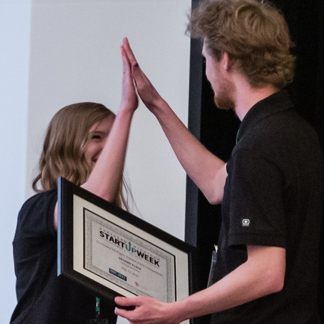

## NMC Startup

### Traverse City's startup community continues to build momentum, creating new opportunities for business and career growth. Efforts and results are being recognized at both the State and national level as demonstrated by the recently released ["The Rural Edge"](https://ruralinnovation.us/resources/storytelling/rural-edge-traverse-city/) video from the Center on Rural Innovation. 

### NMC student startups have evolved from select classroom efforts as shared by Matt Goddard in The Rural Edge video. But, with new leadership, the commitment to Experiential Learning, and a focus on innovation, opportunities for entrepreneurship and startup are expanding across the campus.

### *NMC Startup* is an initiative with the goal of creating a Startup culture at NMC that creates opportunities for creative students and supports our local Startup and Tech Hub ecosystem. The experience is framed in a spring semester course where student teams identify a problem, work with customers to define a solution, create a minimal viable product or service, and pitch the resulting value proposition to the Startup community.

### See additional details on this site and reach out to [Keith Kelly](mailto:kkelly@nmc.edu) with questions or for information on how to participate. 
