## NMC Startup - Class of 2022

Five teams completed the Startup Seminar special topics course in the spring of 2022. The experience culminated with pitching their product to community during Northern Michigan Startup Week. The video of student pitches is available at the YouTube link below with Russell Schindler's comments at 45:45 and NMC student pitches starting at 1:00:00.

[Northwest Michigan Student Pitch Competition 2022](https://www.youtube.com/watch?v=71eK3BvdX7M&ab_channel=TCNewTech)

<!-- team A -->

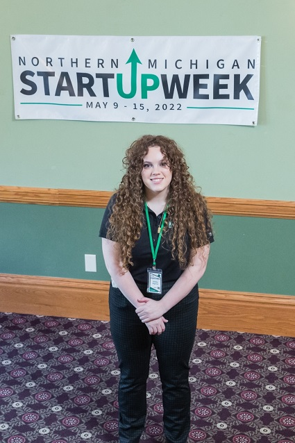

<h3>Founder: Shelby Bigelow</h3>
<ul>
<li>Visual Communications</li> 
<li>Art Direction</li>
</ul> 
<h3>Mentor: Abagail McKiernan, Spark in the Dark</h3>

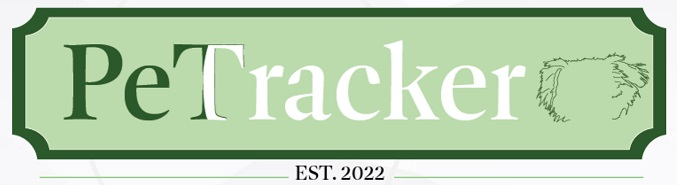

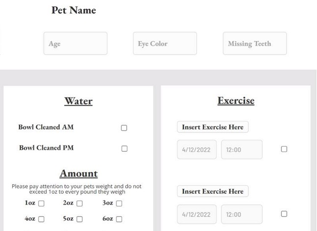

<a href="assets/success/2022/teamA/teamA_pitch.pdf"><h3>Pet Tracker Pitch Deck</h3></a>

<!-- team B -->

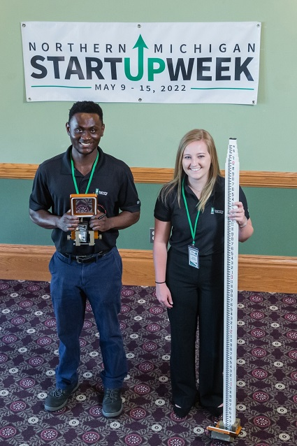

<h3>Founder: Shelby Satkowiak</h3>
<ul>
<li>Marine Technology Major</li>
<li>Survey Engineering Minor</li>
</ul>
<h3>Co-Founder: Manny McMillian</h3>
<ul>
<li>Engineering Technology</li>
<li>Unmanned Aerial Systems</li>
</ul>

<h3>Mentor: Russell Schindler, SampleServe</h3>

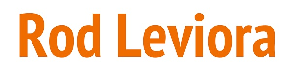

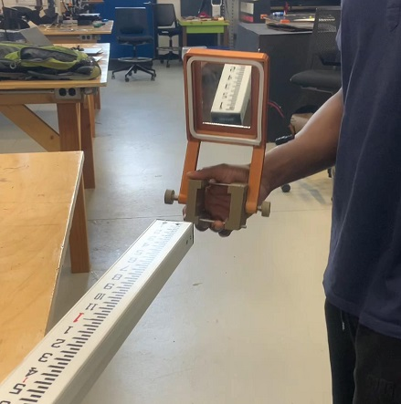

<a href="assets/success/2022/teamB/teamB_pitch.pdf"><h3>Rod Leviora Pitch Deck</h3></a>

<!-- team C -->

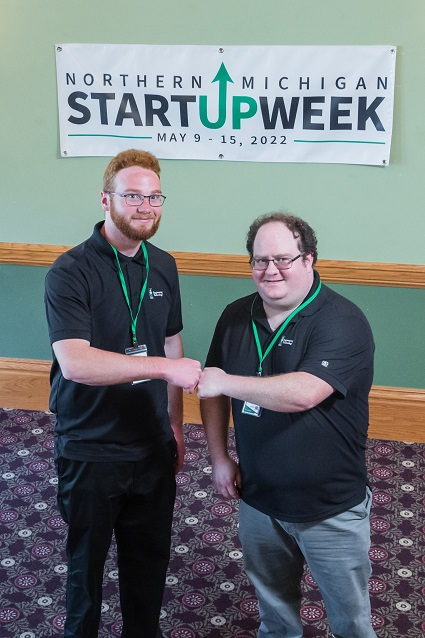

<h3>Founder: Alex Groening</h3>
<ul>
<li>Industrial Controls & Robotics</li>
</ul>
<h3>Co-Founder: Alec Rice</h3>
<ul>
<li>Marine Technology</li>
</ul>

<h3>Mentor: Kevin Clark, Critter Control Inc.</h3>

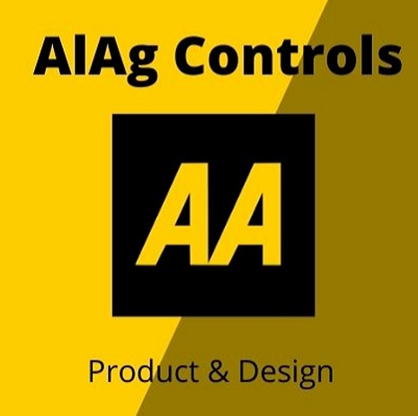

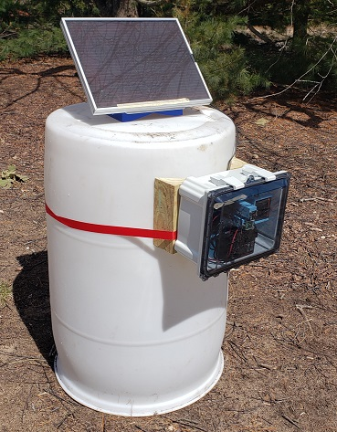

<a href="assets/success/2022/teamC/teamC_pitch.pdf"><h3>AlAg Pitch Deck</h3></a>

<!-- team D -->

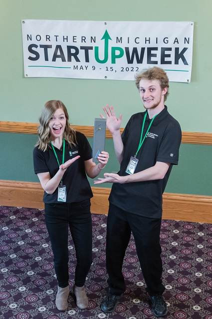

<h3>Founder: Holly Johnson</h3>
<ul>
<li>Visual Communications</li>
</ul>
<h3>Co-Founder: Chase McMaster</h3>
<ul>
<li>Marine Technology</li>
</ul>

<h3>Mentors</h3>
<ul>
<li>David Summers, SCORE Mentors</li>
<li>Danelle Brostrom, Traverse City Area Public Schools</li>
</ul>

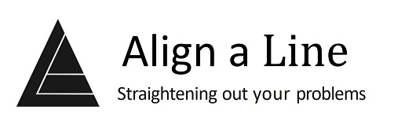

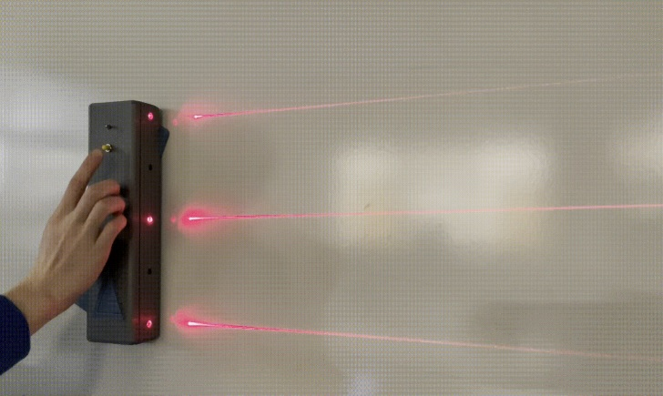

<a href="assets/success/2022/teamD/teamD_pitch.pdf"><h3>Align-A-Line Pitch Deck</h3></a>

<!-- team E -->

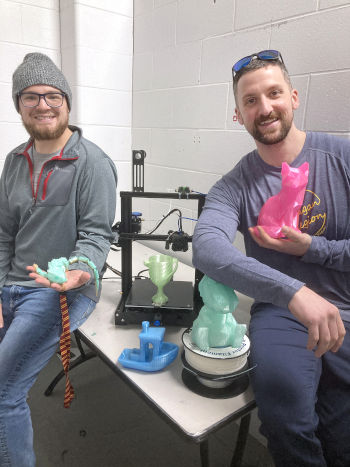

<h3>Founder: Max Streeter</h3>
<h3>Co-Founder: John Monaghan</h3>

<h3>Mentor: Mark Stephens, Interactive Aerial</h3>

<!--

-->

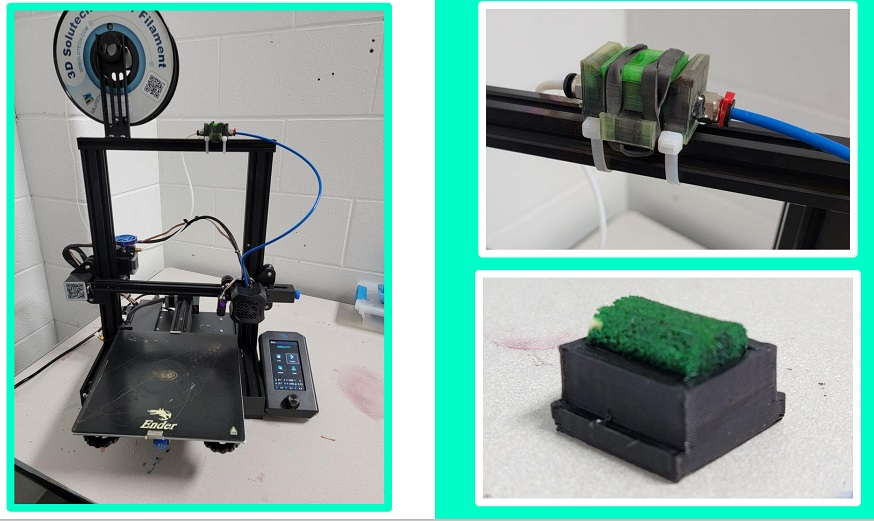

<a href="assets/success/2022/teamE/teamE_pitch.pdf"><h3>Pitch Deck</h3></a>

---

## Early NMC Sucesses in Startup

<!--
### Derek Smith - Naveego -> Aunalytics -> AWS
image of derek at tccode
history
- CIT Developer
- tccodes
- leadr  

### Interactive Aerial - Chris Schmidt, Justin Bensen, Pierce Thomas 
Makerspace history, scale up north, exit

### Hybrid Robotics - Matt Goddard, Aaron Bottkey, Ryan Matter
Prototype in makers, TCNewTech winnner, Recognized during STartup WEek

video NMC - Our Early Startups
https://www.youtube.com/watch?v=SoatUiGvH1E&list=PLMdErdlfK4GYFlPe0ztt65bBFgW_kFXXe&index=2&ab_channel=piRoverBuildswithK2
-->